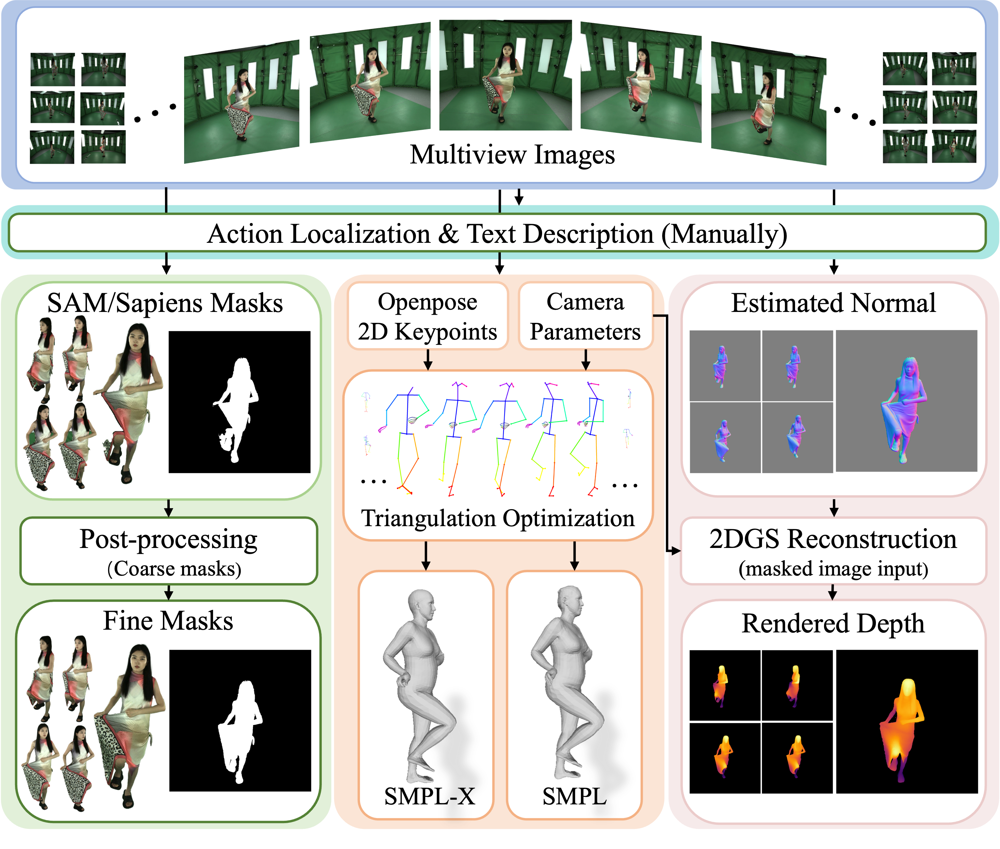

# MVHumanNet++: A Large-scale Dataset of Multi-view Daily Dressing Human Captures with Richer Annotations for 3D Human Digitization
## [Project Page](https://kevinlee09.github.io/research/MVHumanNet++/) | [Paper (Arxiv)](https://arxiv.org/abs/2505.01838) | [Dataset](https://github.com/GAP-LAB-CUHK-SZ/MVHumanNet_plusplus/)


by [Chenghong Li](https://kevinlee09.github.io), Hongjie Liao, Yihao Zhi, Xihe Yang, Zhengwentai Sun, Jiahao Chang,
Shuguang Cui and [Xiaoguang Han†](https://gaplab.cuhk.edu.cn/) from [GAP-Lab](https://gaplab.cuhk.edu.cn/). 


## Introduction

[MVHumanNet](https://github.com/GAP-LAB-CUHK-SZ/MVHumanNet/) contains **4,500** human identities,  **9,000** daily outfits,  **60,000** motion sequences,  **645 million** with extensive annotations, including human masks, camera parameters , 2D and 3D keypoints, SMPL/SMPLX parameters, and corresponding textual descriptions. 

As an extension of [MVHumanNet](https://github.com/GAP-LAB-CUHK-SZ/MVHumanNet/), **MVHumanNet++** is enhanced with newly processed normal maps and depth maps, significantly expanding its applicability and utility for advanced human-centric research. Besides, enhanced segmentations and better smplx estimations are provided.

## Annotation pipeline


## Download
The MVHumanNet Dataset is provided solely for non-commercial research and educational 
purposes.

Please read carefully the [Terms of Use](./Terms_of_Use.pdf) and fill this form [form](https://docs.google.com/forms/d/e/1FAIpQLSeqvmeuJzUdmdU-JQ3ocu-o58Uo1K6xfxaeNOFn-AwYOxCgzQ/viewform) to get the download links.

You can use the following commands to download the dataset. (Thanks @antonzub99 for fixing the downloading scripts.)
```bash
 python download_tool_mvhuman.py --data_name {FOLDER_NAME/FILE_NAME} --url {PLACE_THE_DOWNLOAD_URL_YOU_GET_HERE} --download_folder {SAVE_PATH}
```

### Folder structure 
Please join all six parts of the main_data(`cat main_data_part*.tar.gz > main_data.tar.gz`) and absdepth parts(`cat absdepth_part*.tar.gz > absdepth.tar.gz`) before extracting.


In this version, around 7000 outfits are filtered. We only use the same 16 camera views of the same height for each setup(10xxxx or 20xxxx). Images are sampled every 25 frames of the raw video due to storage limitation.
```
|-- main_data
    |-- train 
        |-- 100831
            |-- images    # 1024 * 1024. 
                |-- cam_00
                    |-- 0025.jpg
                    |-- 0050.jpg
                    ...
                    |-- 1500.jpg # Typically end at 1500.jpg.
                    |-- A-2045.jpg # Selected A-pose image.
                |-- cam_01
                |-- cam_02
                ...
                |-- cam_15
            |-- masks     # 1024 * 1024
                |-- cam_00
                |-- cam_01
                |-- cam_02
                ...
                |-- cam_15
            |-- cameras
                |-- cam_00
                    |-- camera.npz
                |-- cam_01
                |-- cam_02
                ...
                |-- cam_15
            |-- openpose
            |-- smplx_params
            smplx_params.npz
    |-- test # Please note that masks in test may not be all mannual filtered
        ...

|-- absdepth
    |-- 100831
        |-- depths
            |-- cam_00
                |-- 0025.exr
                |-- 0050.exr
                ...
                |-- 1500.exr # Typically end at 1500.jpg.
                |-- A-2045.exr # Selected A-pose image.
            |-- cam_01
            |-- cam_02
            ...
            |-- cam_15
    ...
|-- normal
    |-- 100831
        |-- normal
            |-- cam_00
                |-- 0025.jpg
                |-- 0050.jpg
                ...
                |-- 1500.jpg # Typically end at 1500.jpg.
                |-- A-2045.jpg # Selected A-pose image.
            |-- cam_01
            |-- cam_02
            ...
            |-- cam_15
    ...
```

You can visualize the estimated SMPLX parameters by running this file: [vis_smplx.py](./smplx_visualization/vis_smplx.py).


## License

The data is released under the MVHumanNet and MVHumanNet++ Terms of Use, and the code is released under the Attribution-NonCommercial 4.0 International License.

Copyright (c) 2025

## Citations
If you find our work useful in your research, please consider citing:
```
@inproceedings{xiong2024mvhumannet,
  title={MVHumanNet: A Large-scale Dataset of Multi-view Daily Dressing Human Captures},
  author={Xiong, Zhangyang and Li, Chenghong and Liu, Kenkun and Liao, Hongjie and Hu, Jianqiao and Zhu, Junyi and Ning, Shuliang and Qiu, Lingteng and Wang, Chongjie and Wang, Shijie and others},
  booktitle={Proceedings of the IEEE/CVF Conference on Computer Vision and Pattern Recognition},
  year={2024}
}
```
and 
```
@article{li2025mvhumannet++,
  title={MVHumanNet++: A Large-scale Dataset of Multi-view Daily Dressing Human Captures with Richer Annotations for 3D Human Digitization},
  author={Li, Chenghong and Liao, Hongjie and Zhi, Yihao and Yang, Xihe and Sun, Zhengwentai and Chang, Jiahao and Cui, Shuguang and Han, Xiaoguang},
  journal={arXiv preprint arXiv:2505.01838},
  year={2025}
}
```
